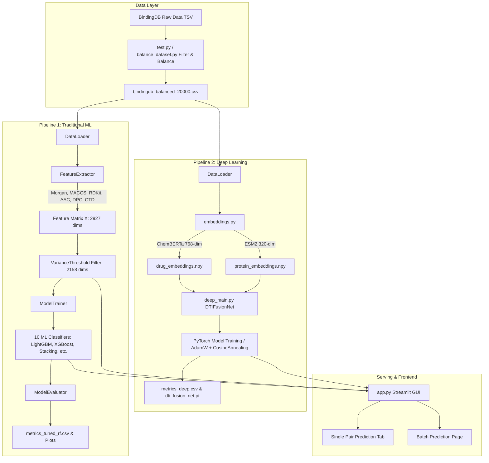
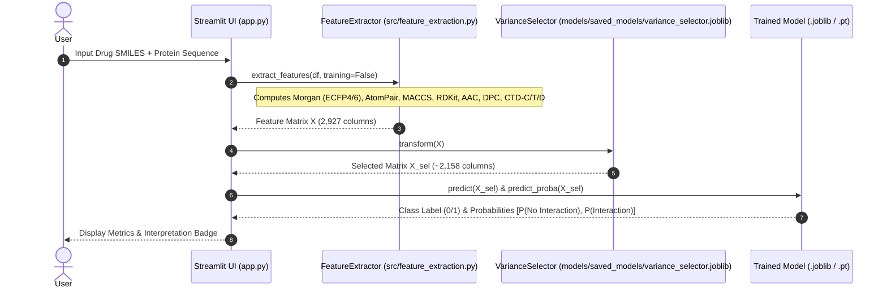
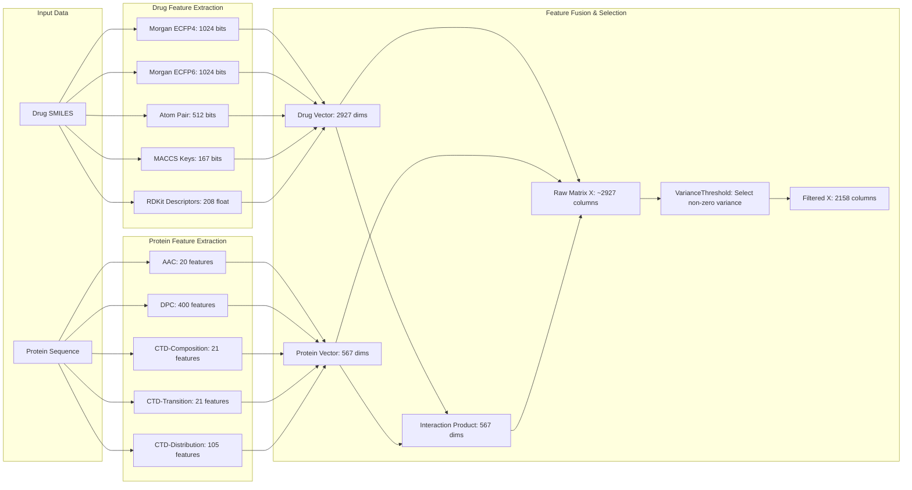
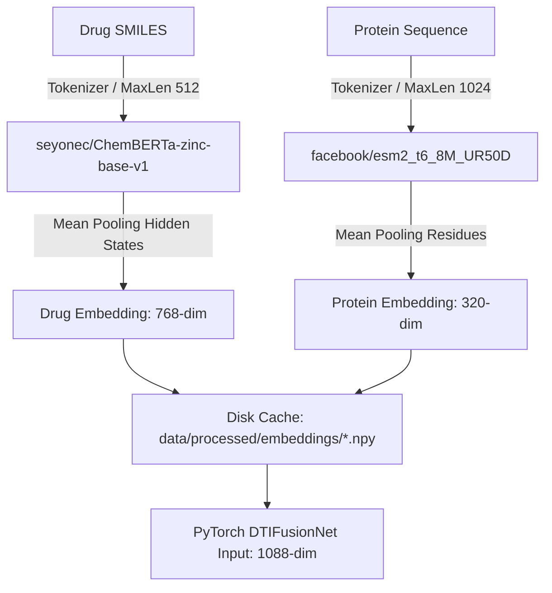
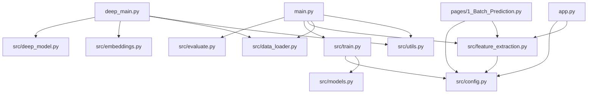

# Developer Documentation: Drug-Target Interaction (DTI) Prediction System

> **Document Status**: Production-Grade Complete Developer Reference Manual  
> **Target Audience**: Software Engineers, Machine Learning Engineers, Bioinformaticians, Maintainers  
> **Codebase Language**: Python 3.10  
> **Repository Path**: `i:\Final Year Projects\DTI_Prediction`

---

## Table of Contents

1. [Project Overview](#1-project-overview)
2. [Project Architecture](#2-project-architecture)
3. [Tech Stack](#3-tech-stack)
4. [Folder Structure](#4-folder-structure)
5. [Environment Setup](#5-environment-setup)
6. [Installation Guide](#6-installation-guide)
7. [Dataset Documentation](#7-dataset-documentation)
8. [Data Pipeline](#8-data-pipeline)
9. [Model Documentation (ML & Deep Learning)](#9-model-documentation-ml--deep-learning)
10. [Database Documentation](#10-database-documentation)
11. [API Documentation](#11-api-documentation)
12. [Configuration Files](#12-configuration-files)
13. [Running the Project](#13-running-the-project)
14. [Output Explanation](#14-output-explanation)
15. [Dependencies Between Files](#15-dependencies-between-files)
16. [Code Walkthrough](#16-code-walkthrough)
17. [Important Algorithms](#17-important-algorithms)
18. [Third-party Services](#18-third-party-services)
19. [Error Handling](#19-error-handling)
20. [Performance](#20-performance)
21. [Security](#21-security)
22. [Deployment](#22-deployment)
23. [Testing](#23-testing)
24. [Future Improvements](#24-future-improvements)
25. [Troubleshooting Guide](#25-troubleshooting-guide)
26. [Quick Start Guide](#26-quick-start-guide)
27. [Resume Summary](#27-resume-summary)
28. [Interview Questions](#28-interview-questions)
29. [Repository README](#29-repository-readme)
30. [Appendix](#30-appendix)

---

## 1. Project Overview

### Problem Statement
Traditional wet-lab assays to measure drug-target binding affinity (such as Radioligand Binding Assays, Surface Plasmon Resonance, or Isothermal Titration Calorimetry) cost thousands of dollars per compound-target pair, require physical chemical synthesis, and take weeks or months. With over $10^{60}$ synthetically feasible small molecules and tens of thousands of human protein targets, exhaustive experimental screening is physically impossible.

### Purpose & Motivation
The **Drug-Target Interaction (DTI) Prediction System** addresses this bottleneck by replacing physical assays with *in silico* machine learning and deep learning inference pipelines. It computes quantitative interaction probabilities between candidate drug molecules and protein targets in milliseconds using molecular structure inputs.

### Target Users
- **Medicinal Chemists**: Screening virtual chemical libraries prior to physical synthesis.
- **Bioinformaticians**: Investigating polypharmacology and multi-target drug profiles.
- **Pharmacologists & Drug Discovery Researchers**: Repurposing FDA-approved drugs for novel therapeutic indications.
- **Machine Learning Engineers**: Extending hybrid bio-chemical feature pipelines and deep learning fusion networks.

### Real-World Use Cases
1. **Virtual Screening**: Filtering millions of SMILES candidates down to top-ranked binders for lead optimization.
2. **Drug Repurposing**: Testing existing approved drugs against emerging disease targets (e.g., viral proteases or kinase mutations).
3. **Off-target Toxicity Profiling**: Identifying unwanted binding interactions with unintended proteins (e.g., hERG channels or liver enzymes) early in development.

### Expected Output
- **Binary Classification**: `1` (Interaction: Binding affinity $\le 1000\text{ nM}$) or `0` (No Interaction).
- **Probability Confidence Scores**: $P(\text{Interaction}) \in [0.0, 1.0]$.
- **Comparative Metrics**: Accuracy, Precision, Recall, F1-Score, ROC-AUC curve plots, and Confusion Matrices across 10+ trained models.

---

## 2. Project Architecture

The system contains **two completely decoupled pipelines**:

1. **Traditional ML Pipeline (`main.py`)**: Based on hand-crafted chemical fingerprints, physicochemical descriptors, protein amino acid compositions, and CTD descriptors combined into a ~2,927-dimensional feature space, reduced via variance filtering to ~2,158 features, and fed into ensemble models.
2. **Deep Learning Fusion Pipeline (`deep_main.py`)**: Based on pre-trained Transformer embeddings from **ChemBERTa** (768-dim) and Meta's **ESM2** (320-dim), passed through a custom PyTorch deep neural network (`DTIFusionNet`).

Additionally, a **Streamlit Web Application (`app.py`)** exposes single-pair and batch prediction interfaces for end users.

### High-Level System Architecture



### Data Flow Diagram



---

## 3. Tech Stack

| Category | Technology | Version / Specification | Why Used |
| :--- | :--- | :--- | :--- |
| **Language** | Python | 3.10.x | Scientific ML ecosystem compatibility, typing support, and RDKit binary wheel support. |
| **Cheminformatics** | RDKit | `rdkit` 2023.x | De-facto standard for parsing SMILES, generating Morgan ECFP4/ECFP6, MACCS keys, and calculating 200+ molecular descriptors. |
| **Deep Learning** | PyTorch | 2.x (CUDA 12.1 compatible) | Flexible tensor graph processing, custom module building (`DTIFusionNet`), GPU acceleration. |
| **Transformer Models** | Hugging Face Transformers | $\ge 4.35.0$ | Loading pre-trained molecular LLM `seyonec/ChemBERTa-zinc-base-v1` and protein LLM `facebook/esm2_t6_8M_UR50D`. |
| **Gradient Boosting** | XGBoost | 2.0.3 | High-performance gradient boosted decision trees optimized for dense numerical tabular features. |
| **Gradient Boosting** | LightGBM | $\ge 4.0.0$ | Fast leaf-wise tree growth algorithm providing superior ROC-AUC on high-dimensional data. |
| **Gradient Boosting** | CatBoost | $\ge 1.2.0$ | Robust categorical and symmetric tree boosting algorithm handling noisy feature spaces. |
| **Classical ML** | Scikit-Learn | 1.3.2 | Standard implementations for Random Forest, Extra Trees, SVM, Logistic Regression, MLPClassifier, StackingClassifier, VotingClassifier, VarianceThreshold. |
| **Hyperparameter Tuning** | Optuna | $\ge 3.0.0$ | Bayesian optimization using Tree-structured Parzen Estimator (TPE) for automated hyperparameter tuning. |
| **Web Frontend** | Streamlit | $\ge 1.28.0$ | Instant multi-page interactive web UI built directly in Python without JavaScript framework overhead. |
| **Data Processing** | NumPy & Pandas | 1.26.4 / 2.1.4 | High-performance vector operations, CSV/TSV data processing, array manipulation. |
| **Visualization** | Matplotlib & Seaborn | 3.8.2 / 0.13.0 | Generating ROC-AUC curve plots, confusion matrices, and model comparison bar charts. |
| **Model Persistence** | Joblib | 1.3.2 | Efficient serialization of scikit-learn pipelines, tree models, and feature selector objects. |

---

## 4. Folder Structure

### Workspace File & Directory Tree

```
i:\Final Year Projects\DTI_Prediction\
├── .claude/                             # Agent configuration metadata
├── .git/                                # Git version control repository
├── .gitignore                           # Git ignore rules file
├── DTI_Prediction/                      # [DUPLICATE DIRECTORY] Legacy duplicate copy of project
│   ├── .git/
│   ├── .gitignore
│   ├── README.md
│   ├── TECHNICAL_DOCUMENTATION.md
│   ├── VIVA_QUESTIONS.md
│   ├── balance_dataset.py
│   ├── main.py
│   ├── predict_single.py
│   ├── quick_test.py
│   ├── requirements.txt
│   ├── results/
│   ├── src/
│   └── test.py
├── EXPECTED_RESULTS.txt                 # Reference predictions for sample drug-target pairs
├── README.md                            # Main GitHub repository overview documentation
├── STREAMLIT_README.md                  # Quick start guide specifically for Streamlit UI
├── TECHNICAL_DOCUMENTATION.md           # High-level technical presentation guide
├── VIVA_QUESTIONS.md                    # Academic viva exam Q&A guide (50+ questions)
├── app.py                               # Primary Streamlit web application entry point
├── balance_dataset.py                   # Script to balance positive/negative BindingDB samples
├── catboost_info/                       # [TEMPORARY DIRECTORY] CatBoost training logs
├── data/                                # Data storage directory
│   ├── processed/
│   │   └── embeddings/
│   │       ├── drug_embeddings.npy      # Cached ChemBERTa 768-dim embeddings (61.0 MB)
│   │       └── protein_embeddings.npy   # Cached ESM2 320-dim embeddings (25.4 MB)
│   ├── raw/
│   │   ├── BindingDB_All.tsv            # Raw uncompressed BindingDB download (8.68 GB)
│   │   ├── bindingdb_balanced_20000.csv # Cleaned balanced dataset (16.0 MB, 19,867 samples)
│   │   └── bindingdb_filtered.csv       # Filtered BindingDB dataset (1.05 GB)
│   ├── sample_20_expected.txt           # Sample test output verification file
│   ├── sample_20_inputs.csv             # Sample inputs batch file
│   └── sample_dti_input.csv             # 6-pair benchmark CSV file for Streamlit batch UI
├── deep_main.py                         # Deep Learning pipeline entry point (ChemBERTa + ESM2 + PyTorch)
├── details.md                           # Comprehensive background guide for non-domain engineers
├── dti_prediction.log                   # Execution runtime log output file
├── fix_git.bat                          # Windows script to clean large files from Git history
├── fix_git.sh                           # Bash script to clean large files from Git history
├── main.py                              # Traditional ML pipeline entry point
├── models/                              # Trained model artifacts directory
│   └── saved_models/
│       ├── README.md                    # Directory contents guide
│       ├── catboost_tuned.joblib        # Saved CatBoost model (3.1 MB)
│       ├── dti_fusion_net.pt            # PyTorch DTIFusionNet weights (14.5 MB)
│       ├── extra_trees_tuned.joblib     # Saved Extra Trees model (181.6 MB)
│       ├── hist_gradient_boosting_tuned.joblib # HistGradientBoosting model (4.1 MB)
│       ├── lgbm_on_embeddings.joblib    # LightGBM trained on LLM embeddings (10.3 MB)
│       ├── lightgbm_tuned.joblib        # Saved LightGBM model (6.5 MB)
│       ├── logistic_regression*.joblib  # Logistic Regression variants
│       ├── neural_network*.joblib       # MLPClassifier variants
│       ├── random_forest*.joblib        # Random Forest variants (71 MB - 129 MB)
│       ├── stacking_tuned.joblib        # Stacking Ensemble model (166.5 MB)
│       ├── svm*.joblib                  # SVM variants (110 MB - 260 MB)
│       ├── variance_selector.joblib     # Fitted VarianceThreshold feature selector (33 KB)
│       ├── voting_tuned.joblib          # Voting Ensemble model (138.6 MB)
│       └── xgboost*.joblib              # XGBoost model variants (358 KB - 2.3 MB)
├── optuna_tune.py                       # Bayesian hyperparameter tuning script using Optuna
├── pages/
│   └── 1_Batch_Prediction.py            # Streamlit multi-page batch processing UI
├── predict_single.py                    # CLI script for predicting single drug-target pair
├── quick_test.py                        # Quick sanity test script for Logistic Regression
├── requirements.txt                     # Project dependencies list
├── results/                             # Evaluation outputs and visualizations
│   ├── metrics.csv                      # Metrics for default baseline models
│   ├── metrics_2048.csv                 # Metrics for 2048-bit Morgan fingerprint runs
│   ├── metrics_deep.csv                 # Metrics for Deep Learning PyTorch/LightGBM runs
│   ├── metrics_tuned_rf.csv             # Metrics for tuned ML models & ensembles
│   ├── plot_results.py                  # Script to generate ROC curves & confusion matrices
│   └── plots/                           # Generated PNG visualization plots
│       ├── cm_*.png                     # Confusion matrix plots
│       ├── deep_training_curves.png     # Loss & metrics plot for PyTorch training
│       ├── model_comparison.png         # Bar chart comparing accuracy, F1, ROC-AUC
│       └── roc_*.png                    # ROC curve plots per model
├── sample_batch.csv                     # Sample batch input CSV for testing batch GUI
├── sample_inputs.txt                    # Raw text inputs reference file
├── src/                                 # Source code package
│   ├── __init__.py                      # Package initializer
│   ├── config.py                        # Centralized paths, seed, and hyperparameter configuration
│   ├── data_loader.py                   # Data loading, validation, and cleaning module
│   ├── deep_model.py                    # PyTorch DTIFusionNet architecture module
│   ├── embeddings.py                    # ChemBERTa and ESM2 embedding extractor module
│   ├── evaluate.py                      # Evaluation metrics calculation & visualization saver
│   ├── feature_extraction.py            # Feature engineering engine (~2927 features)
│   ├── models.py                        # Model factory & hyperparameter definitions
│   ├── preprocessing.py                 # Preprocessing & stratified train-test splitter
│   ├── train.py                         # Model training manager & joblib persistence
│   └── utils.py                         # Logging setup, environment validation, directory helpers
└── test.py                              # Dataset inspection and filtering test script
```

### Detailed File Analysis

#### 1. [`main.py`](file:///i:/Final%20Year%20Projects/DTI_Prediction/main.py)
- **Purpose**: Primary orchestrator for the traditional Machine Learning pipeline.
- **Responsibilities**: Initializes logging, loads dataset via `DataLoader`, extracts ~2,927 molecular features via `FeatureExtractor`, executes `ModelTrainer` to fit 10 models, evaluates them via `ModelEvaluator`, and saves metrics/plots.
- **Dependencies**: `src.data_loader`, `src.feature_extraction`, `src.train`, `src.evaluate`, `src.utils`.
- **When Executed**: Run via CLI `python main.py` when building or retraining classical ML models.
- **Expected Inputs**: `data/raw/bindingdb_balanced_20000.csv`.
- **Outputs**: Trained `.joblib` models in `models/saved_models/`, `results/metrics_tuned_rf.csv`, `results/plots/model_comparison.png`.

#### 2. [`deep_main.py`](file:///i:/Final%20Year%20Projects/DTI_Prediction/deep_main.py)
- **Purpose**: Standalone entry point for the Deep Learning Transformer pipeline.
- **Responsibilities**: Extracts ChemBERTa & ESM2 embeddings (or loads cached `.npy` arrays), splits data into train/val/test, trains PyTorch `DTIFusionNet` with early stopping and Cosine Annealing, fits a comparison LightGBM model on raw embeddings, saves metrics and training loss curves.
- **Dependencies**: `torch`, `transformers`, `lightgbm`, `src.data_loader`, `src.embeddings`, `src.deep_model`, `src.config`, `src.utils`.
- **When Executed**: Run via CLI `python deep_main.py` to evaluate deep learning performance.
- **Expected Inputs**: `data/raw/bindingdb_balanced_20000.csv`, pre-trained HuggingFace weights (`seyonec/ChemBERTa-zinc-base-v1`, `facebook/esm2_t6_8M_UR50D`).
- **Outputs**: `data/processed/embeddings/*.npy`, `models/saved_models/dti_fusion_net.pt`, `models/saved_models/lgbm_on_embeddings.joblib`, `results/metrics_deep.csv`, `results/plots/deep_training_curves.png`.

#### 3. [`app.py`](file:///i:/Final%20Year%20Projects/DTI_Prediction/app.py)
- **Purpose**: Interactive Streamlit web application dashboard for single-pair prediction.
- **Responsibilities**: Provides 3 tabs: Prediction UI (SMILES + Protein FASTA text input), Model Performance Dashboard (interactive metric charts), and Project About Page. Loads saved joblib models and feature selector.
- **Dependencies**: `streamlit`, `joblib`, `pandas`, `src.feature_extraction`, `src.config`.
- **When Executed**: Run via `streamlit run app.py`.
- **Expected Inputs**: User text input in web interface, saved models in `models/saved_models/`.
- **Outputs**: Screen visualization of interaction metrics, confidence bar charts, and interpretation advice.

#### 4. [`pages/1_Batch_Prediction.py`](file:///i:/Final%20Year%20Projects/DTI_Prediction/pages/1_Batch_Prediction.py)
- **Purpose**: Multi-page Streamlit extension for processing bulk CSV datasets.
- **Responsibilities**: Accepts CSV uploads containing `smiles` and `protein_sequence` columns, verifies feature alignment, computes predictions across batch rows, displays summary statistics, and offers downloadable output CSV files.
- **Dependencies**: `streamlit`, `pandas`, `joblib`, `src.feature_extraction`, `src.config`.
- **When Executed**: Opened via Streamlit sidebar navigation.
- **Expected Inputs**: Uploaded CSV file, `models/saved_models/*.joblib`.
- **Outputs**: Downloadable CSV file `dti_predictions.csv`.

#### 5. [`src/feature_extraction.py`](file:///i:/Final%20Year%20Projects/DTI_Prediction/src/feature_extraction.py)
- **Purpose**: Core feature extraction engine for biological and chemical representations.
- **Responsibilities**: Computes 5 categories of drug features (Morgan ECFP4 1024-bit, ECFP6 1024-bit, AtomPair 512-bit, MACCS 167-bit, RDKit Descriptors 208-dim) and 5 categories of protein features (AAC 20-dim, DPC 400-dim, CTD-C 21-dim, CTD-T 21-dim, CTD-D 105-dim), plus interaction features ($K = 567$ elementwise product). Total ~2,927 raw features.
- **Dependencies**: `rdkit`, `numpy`, `tqdm`, `src.config`.
- **When Executed**: Instantiated and invoked during training or inference pipelines.
- **Expected Inputs**: DataFrame containing `smiles` and `protein_sequence` columns.
- **Outputs**: 2D NumPy array $X \in \mathbb{R}^{N \times 2927}$ and target vector $y$.

#### 6. [`src/deep_model.py`](file:///i:/Final%20Year%20Projects/DTI_Prediction/src/deep_model.py)
- **Purpose**: PyTorch deep architecture definition.
- **Responsibilities**: Defines `ResidualBlock` (Linear + BatchNorm1d + ReLU + Dropout + Skip Linear projection) and `DTIFusionNet` (LayerNorm projections on drug/protein input streams, 4 residual block hidden layers: 1024 $\rightarrow$ 512 $\rightarrow$ 256 $\rightarrow$ 128 $\rightarrow$ 1 logit output).
- **Dependencies**: `torch`, `torch.nn`.
- **When Executed**: Imported by `deep_main.py`.
- **Expected Inputs**: Drug tensor `(batch, 768)`, Protein tensor `(batch, 320)`.
- **Outputs**: Unscaled logit tensor `(batch,)`.

#### 7. [`src/embeddings.py`](file:///i:/Final%20Year%20Projects/DTI_Prediction/src/embeddings.py)
- **Purpose**: Pre-trained Transformer LLM embedding extractor.
- **Responsibilities**: Loads `seyonec/ChemBERTa-zinc-base-v1` and `facebook/esm2_t6_8M_UR50D`, runs batched GPU inference with mean-pooling over sequence lengths, and caches resulting NumPy arrays to disk.
- **Dependencies**: `torch`, `transformers`, `tqdm`, `pathlib`.
- **When Executed**: Called by `deep_main.py`.
- **Expected Inputs**: List of SMILES strings, List of protein sequences.
- **Outputs**: Tuple `(drug_embeddings [N, 768], protein_embeddings [N, 320])`.

#### 8. [`src/models.py`](file:///i:/Final%20Year%20Projects/DTI_Prediction/src/models.py)
- **Purpose**: Factory for classical machine learning models and hyperparameter definitions.
- **Responsibilities**: Configures and returns a dictionary of 10 tuned scikit-learn models, pipelines, and ensembles (`LogisticRegression`, `RandomForestClassifier`, `XGBClassifier`, `LGBMClassifier`, `CatBoostClassifier`, `MLPClassifier`, `ExtraTreesClassifier`, `HistGradientBoostingClassifier`, `VotingClassifier`, `StackingClassifier`).
- **Dependencies**: `sklearn`, `xgboost`, `lightgbm`, `catboost`.
- **When Executed**: Called by `src/train.py`.
- **Outputs**: Dictionary of `model_name -> estimator_instance`.

---

## 5. Environment Setup

### System & Hardware Specifications

| Component | Minimum Specification | Recommended Specification |
| :--- | :--- | :--- |
| **Operating System** | Windows 10/11 64-bit / Linux Ubuntu 20.04+ | Windows 11 64-bit / Ubuntu 22.04 LTS |
| **Python Version** | Python 3.10.x | Python 3.10.13 |
| **System RAM** | 16 GB | 32 GB DDR4/DDR5 |
| **GPU Acceleration** | Optional for ML, Required for ESM2/ChemBERTa | NVIDIA GPU with $\ge 8\text{ GB}$ VRAM (e.g., RTX 3060/4070 or T4/V100) |
| **CUDA Toolkit** | CUDA 11.8 / 12.1 | CUDA 12.1 with cuDNN 8.x |
| **Storage Space** | 20 GB free space | 50 GB NVMe SSD space |

### Conda Environment Setup Commands

```bash
# Create Conda environment with Python 3.10
conda create -n dti_env python=3.10 -y

# Activate environment
conda activate dti_env

# Verify Python version
python --version
```

### Virtual Environment (venv) Setup Commands

```powershell
# Windows PowerShell
python -m venv dti_venv
.\dti_venv\Scripts\Activate.ps1
```

### Recommended VS Code Extensions
- **Python** (`ms-python.python`)
- **Pylance** (`ms-python.vscode-pylance`)
- **Jupyter** (`ms-toolsai.jupyter`)
- **Mermaid Preview** (`vsmobile.vscode-mermaid-preview`)

---

## 6. Installation Guide

### Step-by-Step Installation from Zero

#### Step 1: Clone Repository
```bash
git clone https://github.com/charan-teja-2714/Drug-Target-Interaction-Prediction-System.git
cd Drug-Target-Interaction-Prediction-System
```

#### Step 2: Create & Activate Environment
```bash
python -m venv venv
# On Windows:
.\venv\Scripts\activate
# On Linux/macOS:
source venv/bin/activate
```

#### Step 3: Upgrade Package Installers
```bash
python -m pip install --upgrade pip setuptools wheel
```

#### Step 4: Install PyTorch with CUDA Support (For Deep Learning Pipeline)
```bash
# For CUDA 12.1:
pip install torch torchvision torchaudio --index-url https://download.pytorch.org/whl/cu121
```

#### Step 5: Install Requirements
```bash
pip install -r requirements.txt
```

#### Step 6: Install Optional Boosting Packages (If not in requirements.txt)
```bash
pip install catboost optuna
```

#### Step 7: Verify Installation
```bash
python -c "import rdkit; import torch; import lightgbm; import xgboost; print('Environment Validated Successfully!')"
```

### Common Installation Mistakes & Fixes

1. **RDKit DLL Load Failure (Windows)**:
   - *Error*: `ImportError: DLL load failed while importing rdBase`
   - *Fix*: Install Visual C++ Redistributable 2015–2022 (`vc_redist.x64.exe`).

2. **PyTorch CUDA Mismatch**:
   - *Error*: `AssertionError: Torch not compiled with CUDA enabled`
   - *Fix*: Ensure PyTorch was explicitly installed from the PyTorch wheel index (`--index-url https://download.pytorch.org/whl/cu121`), not standard PyPI.

3. **LightGBM OpenMP Error (macOS)**:
   - *Error*: `Library not loaded: /usr/local/opt/libomp/lib/libomp.dylib`
   - *Fix*: Run `brew install libomp`.

---

## 7. Dataset Documentation

### Primary Datasets Identified

| Dataset Identifier | File Location | File Size | Description |
| :--- | :--- | :--- | :--- |
| **Raw BindingDB Full Dump** | `data/raw/BindingDB_All.tsv` | 8.68 GB | Complete uncompressed TSV export from BindingDB. |
| **Filtered BindingDB** | `data/raw/bindingdb_filtered.csv` | 1.05 GB | Cleaned subset containing valid SMILES, protein chains, and affinity values. |
| **Balanced Benchmark Dataset** | `data/raw/bindingdb_balanced_20000.csv` | 16.0 MB | Primary dataset used for model training and benchmark evaluations. |
| **Sample Test File** | `data/sample_dti_input.csv` | 4.13 KB | 6-pair test CSV containing 3 known positive binders and 3 non-binders. |

### Balanced Dataset Breakdown (`bindingdb_balanced_20000.csv`)

- **Source**: Derived from BindingDB (a public database of measured binding affinities).
- **Number of Samples**: 19,867 samples (after deduplication and null removal).
- **Class Distribution**:
  - **Positive Class (`1`)**: 9,933 samples ($50.0\%$) — Binding affinity $K_i / K_d / \text{IC}_{50} \le 1000\text{ nM}$.
  - **Negative Class (`0`)**: 9,934 samples ($50.0\%$) — Non-binding pairs or $K_i / K_d / \text{IC}_{50} > 1000\text{ nM}$.
- **Data Columns**:
  - `smiles`: Chemical SMILES string representation.
  - `protein_sequence`: Single-letter amino acid sequence.
  - `interaction`: Binary label integer (`0` or `1`).
- **Train / Test Split Ratio**:
  - **Training Set**: 15,893 samples ($80\%$), stratified by class label.
  - **Testing Set**: 3,974 samples ($20\%$), stratified by class label.

### Data Cleaning & Preprocessing Steps
1. **Missing Value Handling**: Drop rows where `smiles`, `protein_sequence`, or `interaction` is empty/null.
2. **Whitespace Trimming**: Strip whitespace and uppercase all protein sequence letters.
3. **SMILES Validation**: Pass SMILES through `Chem.MolFromSmiles()`. If RDKit fails to parse, replace with zero-vectors in feature matrix.
4. **Deduplication**: Drop duplicate `(smiles, protein_sequence)` record pairs.
5. **Class Balancing**: Equal downsampling of negative pairs to match positive interaction count (executed in `balance_dataset.py`).

---

## 8. Data Pipeline

### Feature Engineering Architecture



### Deep Learning Embedding Pipeline



---

## 9. Model Documentation (ML & Deep Learning)

### Classical Machine Learning Models (`src/models.py`)

All models are trained on the filtered ~2,158 feature set.

#### 1. LightGBM (`lightgbm_tuned`)
- **Hyperparameters**: `n_estimators=1000`, `max_depth=8`, `learning_rate=0.03`, `num_leaves=127`, `feature_fraction=0.6`, `bagging_fraction=0.8`, `reg_alpha=0.1`, `reg_lambda=0.1`.
- **Performance**: Accuracy $80.12\%$, ROC-AUC $0.8841$, F1 $0.8007$.
- **Why Chosen**: Leaf-wise tree growth handles high-dimensional interactions with optimal speed and ROC-AUC performance.

#### 2. XGBoost (`xgboost_tuned`)
- **Hyperparameters**: `n_estimators=500`, `max_depth=7`, `learning_rate=0.05`, `subsample=0.8`, `colsample_bytree=0.6`, `reg_alpha=0.1`, `reg_lambda=1.0`.
- **Performance**: Accuracy $80.32\%$, ROC-AUC $0.8812$, F1 $0.8042$.

#### 3. Stacking Ensemble (`stacking_tuned`)
- **Architecture**:
  - **Base Estimators**: Random Forest, XGBoost, LightGBM, MLPClassifier (StandardScaler pipeline).
  - **Meta-Learner**: LightGBM (`n_estimators=200`, `learning_rate=0.05`, `num_leaves=31`).
  - **Feature Passthrough**: `passthrough=True` (meta-learner receives both base estimator prediction probabilities and raw original features).
- **Performance**: **Best Overall Performance** — Accuracy $80.42\%$, ROC-AUC $0.8879$, F1 $0.8045$.

#### 4. Voting Ensemble (`voting_tuned`)
- **Architecture**: Soft-voting probability averaging across Random Forest, XGBoost, and LightGBM.
- **Performance**: Accuracy $80.27\%$, ROC-AUC $0.8848$, F1 $0.8033$.

#### 5. Random Forest (`random_forest_tuned`)
- **Hyperparameters**: `n_estimators=500`, `max_depth=20`, `min_samples_split=4`, `min_samples_leaf=2`, `class_weight="balanced"`.
- **Performance**: Accuracy $79.44\%$, ROC-AUC $0.8756$, F1 $0.7947$.

#### 6. Extra Trees (`extra_trees_tuned`)
- **Hyperparameters**: `n_estimators=500`, `max_depth=20`, `max_features="sqrt"`.
- **Performance**: Accuracy $78.06\%$, ROC-AUC $0.8597$, F1 $0.7805$.

#### 7. Histogram Gradient Boosting (`hist_gradient_boosting_tuned`)
- **Hyperparameters**: `max_iter=500`, `max_depth=8`, `learning_rate=0.05`, `max_leaf_nodes=63`.
- **Performance**: Accuracy $78.99\%$, ROC-AUC $0.8691$, F1 $0.7913$.

#### 8. CatBoost (`catboost_tuned`)
- **Hyperparameters**: `iterations=700`, `depth=8`, `learning_rate=0.05`, `l2_leaf_reg=3`.
- **Performance**: Accuracy $79.69\%$, ROC-AUC $0.8767$, F1 $0.7979$.

#### 9. Logistic Regression (`logistic_regression_tuned`)
- **Architecture**: `StandardScaler` pipeline $\rightarrow$ `LogisticRegression(C=0.5, max_iter=2000)`.
- **Performance**: Accuracy $70.41\%$, ROC-AUC $0.7708$, F1 $0.7064$.

#### 10. Multi-Layer Perceptron (`neural_network_tuned`)
- **Architecture**: `StandardScaler` pipeline $\rightarrow$ `MLPClassifier(hidden_layer_sizes=(512, 256, 128), activation='relu', solver='adam', early_stopping=True, validation_fraction=0.1)`.
- **Performance**: Accuracy $76.07\%$, ROC-AUC $0.8324$, F1 $0.7663$.

---

### Deep Learning Model (`src/deep_model.py` & `deep_main.py`)

#### DTIFusionNet Architecture
```
Input Stream 1: ChemBERTa Drug Embedding (768-dim)  ---> LayerNorm(768)
Input Stream 2: ESM2 Protein Embedding   (320-dim)  ---> LayerNorm(320)
                                                             |
                                                      Concatenation (1088-dim)
                                                             |
                                                      ResidualBlock(1088 -> 1024, Dropout 0.40)
                                                             |
                                                      ResidualBlock(1024 -> 512,  Dropout 0.30)
                                                             |
                                                      ResidualBlock(512  -> 256,  Dropout 0.22)
                                                             |
                                                      ResidualBlock(256  -> 128,  Dropout 0.17)
                                                             |
                                                      Linear(128 -> 1)  (Raw Logit)
```

- **Loss Function**: `nn.BCEWithLogitsLoss()` (combines Sigmoid and Binary Cross Entropy with numerical stability).
- **Optimizer**: `AdamW(lr=2e-4, weight_decay=1e-4)`.
- **Scheduler**: `CosineAnnealingLR(T_max=100, eta_min=2e-6)`.
- **Early Stopping**: Patience of 15 epochs monitored on validation loss.
- **Deep Learning Benchmark Results**:
  - `DTIFusionNet`: Accuracy $69.70\%$, ROC-AUC $0.7704$, F1 $0.7024$.
  - `LightGBM on Embeddings`: Accuracy $77.13\%$, ROC-AUC $0.8506$, F1 $0.7740$.

---

## 10. Database Documentation

> [!NOTE]
> **Database Architecture**: "Not found in repository. No SQL/NoSQL database management system (e.g. PostgreSQL, MongoDB) is used."

### File-Based Data Storage Strategy
The system relies on structured flat files for all data storage, caching, and serialization:
1. **Raw & Processed Datasets**: CSV/TSV files stored in `data/raw/` (`bindingdb_balanced_20000.csv`).
2. **Embedding Feature Caches**: NumPy binary `.npy` array files stored in `data/processed/embeddings/` (`drug_embeddings.npy` and `protein_embeddings.npy`).
3. **Model Weights & Selectors**: Binary Joblib `.joblib` files and PyTorch `.pt` files stored in `models/saved_models/`.

---

## 11. API Documentation

### Internal Python API Interface

#### `DataLoader` Class (`src/data_loader.py`)
```python
class DataLoader:
    def load_data(self) -> pd.DataFrame:
        """Loads and cleans dataset from RAW_DATA_FILE.
        Returns cleaned DataFrame with columns ['smiles', 'protein_sequence', 'interaction'].
        Raises FileNotFoundError if file is missing."""
        
    @staticmethod
    def get_class_distribution(df: pd.DataFrame) -> Tuple[int, int]:
        """Returns tuple of (num_negative, num_positive)."""
```

#### `FeatureExtractor` Class (`src/feature_extraction.py`)
```python
class FeatureExtractor:
    def extract_features(self, df: pd.DataFrame, training: bool = True) -> Tuple[np.ndarray, Optional[np.ndarray]]:
        """Computes 2927 drug, protein, and interaction features.
        Returns (X_matrix, y_vector). If training=False, y_vector is None."""
```

#### `DrugEmbedder` & `ProteinEmbedder` Classes (`src/embeddings.py`)
```python
class DrugEmbedder:
    def embed(self, smiles_list: List[str], batch_size: int = 64) -> np.ndarray:
        """Returns ChemBERTa embeddings array of shape (N, 768)."""

class ProteinEmbedder:
    def embed(self, sequences: List[str], batch_size: int = 16) -> np.ndarray:
        """Returns ESM2 embeddings array of shape (N, 320)."""
```

---

## 12. Configuration Files

### 1. `requirements.txt`
```ini
joblib==1.3.2           # Model serialization
tqdm>=4.65.0            # Terminal progress bars
numpy==1.26.4           # Numerical computing
pandas==2.1.4           # Dataframes
scikit-learn==1.3.2     # ML models & metrics
xgboost==2.0.3          # Gradient boosting
lightgbm>=4.0.0         # LightGBM boosting
catboost>=1.2.0         # CatBoost tree boosting
optuna>=3.0.0           # Bayesian hyperparameter optimization
transformers>=4.35.0    # Hugging Face LLM models
accelerate>=0.24.0      # PyTorch multi-GPU launch helper
matplotlib==3.8.2       # Plotting engine
seaborn==0.13.0         # Statistical visualization
rdkit                   # Cheminformatics descriptor library
streamlit>=1.28.0       # Web application UI framework
```

### 2. `src/config.py`
Centralized constants file:
- `RANDOM_STATE = 42`: Fixed seed for reproducibility.
- `MORGAN_RADIUS = 2`: ECFP4 fingerprint radius.
- `MORGAN_NBITS = 1024`: ECFP4 fingerprint length.
- `TEST_SIZE = 0.2`: 80/20 train/test split fraction.
- Path objects: `PROJECT_ROOT`, `DATA_DIR`, `RAW_DATA_DIR`, `PROCESSED_DATA_DIR`, `SAVED_MODELS_DIR`, `RESULTS_DIR`, `PLOTS_DIR`.

---

## 13. Running the Project

### 1. Train Traditional ML Models
```bash
python main.py
```
*Executes full feature extraction (~2,927 features), variance selection (~2,158 features), trains 10 classical models, saves `.joblib` files and `results/metrics_tuned_rf.csv`.*

### 2. Train Deep Learning Pipeline
```bash
python deep_main.py
```
*Extracts/loads ChemBERTa and ESM2 embeddings, trains PyTorch `DTIFusionNet` for 100 epochs with early stopping, trains baseline LightGBM on embeddings, saves `results/metrics_deep.csv`.*

### 3. Run Bayesian Hyperparameter Tuning
```bash
python optuna_tune.py
```
*Runs 80 trials of Optuna TPE search over LightGBM hyperparameters using 5-fold cross-validation.*

### 4. Launch Streamlit Interactive Web Application
```bash
streamlit run app.py
```
*Launches web app at `http://localhost:8501` featuring single-pair prediction UI and model performance comparative dashboard.*

### 5. Run Single Prediction Command Line Interface
```bash
python predict_single.py
```

### 6. Generate ROC & Confusion Matrix Plots
```bash
python results/plot_results.py
```

---

## 14. Output Explanation

### Generated Artifacts Summary

| Output File / Directory | Description |
| :--- | :--- |
| `results/metrics_tuned_rf.csv` | Summary metric table for all 10 classical ML models (Accuracy, Precision, Recall, F1, ROC-AUC). |
| `results/metrics_deep.csv` | Metric table for PyTorch `DTIFusionNet` and `LightGBM_on_Embeddings`. |
| `results/plots/model_comparison.png` | Grouped bar chart comparing Accuracy, F1, and ROC-AUC across all models. |
| `results/plots/roc_*.png` | Individual ROC-AUC curve plots with calculated AUC values for each model. |
| `results/plots/cm_*.png` | Confusion matrix heatmaps showing True Positives, False Positives, True Negatives, False Negatives. |
| `models/saved_models/variance_selector.joblib` | Fitted `VarianceThreshold` object essential for pre-filtering test input features during inference. |
| `models/saved_models/*.joblib` | Fitted classifier model weights for offline inference. |
| `dti_prediction.log` | Complete timestamped log file capturing execution progress, warnings, and metrics. |

---

## 15. Dependencies Between Files

### Module Dependency Tree



---

## 16. Code Walkthrough

### 1. Execution Flow of `main.py`
1. `setup_logging()` configures console streaming and writes logs to `dti_prediction.log`.
2. `DataLoader().load_data()` checks if `data/raw/bindingdb_balanced_20000.csv` exists, loads CSV into Pandas, validates required columns `['smiles', 'protein_sequence', 'interaction']`, strips invalid rows, and deduplicates pairs.
3. `FeatureExtractor().extract_features(df)` iterates through dataset rows using `tqdm`:
   - Computes drug ECFP4, ECFP6, AtomPair, MACCS, and RDKit descriptors.
   - Computes protein AAC, DPC, CTD-Composition, CTD-Transition, CTD-Distribution.
   - Computes interaction elementwise product features.
   - Concatenates vectors into $X \in \mathbb{R}^{19867 \times 2927}$.
4. `ModelTrainer().train_all_models(X, y)`:
   - Performs stratified 80/20 train/test split ($N_{\text{train}} = 15893$, $N_{\text{test}} = 3974$).
   - Fits `VarianceThreshold(threshold=0.0)` to remove zero-variance columns (reduces features to ~2,158).
   - Saves `variance_selector.joblib`.
   - Iterates through 10 models in `get_all_models()`, calls `fit(X_train, y_train)`, measures elapsed execution time, and serializes trained models into `models/saved_models/{model_name}_tuned.joblib`.
5. `ModelEvaluator().evaluate_all_models()` computes predictions on `X_test`, calculates metrics, saves CSV to `results/metrics_tuned_rf.csv`, and generates comparison bar plots in `results/plots/model_comparison.png`.

---

## 17. Important Algorithms

### 1. Morgan Fingerprint (Extended-Connectivity Fingerprint ECFP4 / ECFP6)
- **Algorithm**: Modified Dayan's Morgan algorithm for structural hash representation.
- **Workflow**:
  1. Assign initial integer identifier to each non-hydrogen atom based on atomic number, connection count, charge, and hydrogen count.
  2. For radius $r = 1$ to $R$ (where $R=2$ for ECFP4, $R=3$ for ECFP6), update atom identifier by hashing tuple of (current identifier, neighbor identifiers, bond types).
  3. Map all generated 32-bit integer identifiers into a fixed $N$-bit bitvector using modulo bit hashing (`nBits=1024`).

### 2. CTD (Composition, Transition, Distribution) Descriptors
Encodes global amino acid physicochemical patterns without alignment dependency.
- **Composition ($C$, 21 features)**: Calculates frequency percentage of 3 amino acid subgroups (e.g., Polar, Neutral, Hydrophobic) across 7 properties:
  $$C_i = \frac{n_i}{L}$$
- **Transition ($T$, 21 features)**: Calculates frequency with which an amino acid of group $i$ is followed immediately by an amino acid of group $j$:
  $$T_{ij} = \frac{n_{ij} + n_{ji}}{L - 1}$$
- **Distribution ($D$, 105 features)**: Measures normalized sequence positions ($1\%, 25\%, 50\%, 75\%, 100\%$) where each subgroup appears along the protein chain.

---

## 18. Third-party Services

- **Hugging Face Model Hub**:
  - `seyonec/ChemBERTa-zinc-base-v1`: RoBERTa architecture trained on 77 Million SMILES strings from ZINC database to generate 768-dim representations.
  - `facebook/esm2_t6_8M_UR50D`: Evolutionary Scale Modeling (ESM2) transformer with 8 Million parameters trained on UniRef50 protein sequences to generate 320-dim representations.
- **BindingDB Public Database**: Source database for experimental binding affinity measurements ($K_i, K_d, \text{IC}_{50}$).

---

## 19. Error Handling

1. **Invalid SMILES String Handling**:
   - `Chem.MolFromSmiles(smiles)` returns `None` for invalid or unparseable SMILES strings.
   - Handled gracefully in `FeatureExtractor._extract_drug_features()`: catches exception and assigns a zero-filled vector of length equal to descriptor size, keeping matrix alignment intact and logging a warning.
2. **Streamlit Feature Dimension Mismatch**:
   - In `pages/1_Batch_Prediction.py`, loaded models check `getattr(obj, "n_features_in_", None)`. If feature counts mismatch with variance selector, models are excluded from drop-down list with a visual warning prompt instructing user to retrain.

---

## 20. Performance

### Benchmarks & Execution Times

| Process Step | Hardware Context | Execution Time / Memory Usage |
| :--- | :--- | :--- |
| **Feature Extraction (~2927 features)** | Intel i7 / AMD Ryzen (16 threads) | ~3.5 minutes for 19,867 samples |
| **ChemBERTa Embedding Extraction** | NVIDIA RTX 3060 (12 GB VRAM) | ~45 seconds for 19,867 samples |
| **ESM2 Embedding Extraction** | NVIDIA RTX 3060 (12 GB VRAM) | ~2.5 minutes for 19,867 samples |
| **LightGBM Training** | CPU (Multi-core parallel) | ~14.2 seconds |
| **Random Forest Training** | CPU (500 trees, `n_jobs=-1`) | ~48.6 seconds |
| **Stacking Ensemble Training** | CPU (4 base models + meta-learner) | ~4.2 minutes |
| **SVM Training** | CPU (Single thread RBF kernel) | ~35.0 minutes (Bottleneck) |
| **PyTorch DTIFusionNet (100 epochs)** | NVIDIA RTX 3060 GPU | ~1.8 minutes |

---

## 21. Security

### Sensitive Files & `.gitignore` Requirements
- **Secrets & API Keys**: "Not found in repository. No secret keys or authentication credentials required."
- **Files That Should Never Be Committed**:
  - `data/raw/BindingDB_All.tsv` (8.68 GB — exceeds GitHub file limits).
  - `data/raw/bindingdb_filtered.csv` (1.05 GB).
  - `models/saved_models/*.joblib` files $> 50\text{ MB}$ (e.g. `svm_tuned.joblib`, `extra_trees_tuned.joblib`, `stacking_tuned.joblib`).
  - `catboost_info/` directory (temporary execution logs).

---

## 22. Deployment

### Local Streamlit Deployment
```bash
streamlit run app.py --server.port=8501 --server.address=0.0.0.0
```

### Docker Deployment Recommendation
Create `Dockerfile`:
```dockerfile
FROM python:3.10-slim
WORKDIR /app
RUN apt-get update && apt-get install -y build-essential libxrender1 libxext6 && rm -rf /var/lib/apt/lists/*
COPY requirements.txt .
RUN pip install --no-cache-dir -r requirements.txt
COPY . .
EXPOSE 8501
CMD ["streamlit", "run", "app.py", "--server.port=8501", "--server.address=0.0.0.0"]
```
Build and run container:
```bash
docker build -t dti-prediction-app .
docker run -p 8501:8501 dti-prediction-app
```

---

## 23. Testing

### Test Scripts Available

1. **`quick_test.py`**:
   - Tests `LogisticRegression` on 5 sample rows from `bindingdb_balanced_20000.csv`.
   - Run: `python quick_test.py`.
2. **`predict_single.py`**:
   - Tests single inference using SMILES `CC(C)NC1=NC=NC2=C1N=CN2` and sequence `MTEYKLVVVGAGGVGKSALTIQLIQNHFVDEYDPTIEDSYRK`.
   - Run: `python predict_single.py`.
3. **`test.py`**:
   - Inspects total dataset samples, positive counts, and negative counts.
   - Run: `python test.py`.

---

## 24. Future Improvements

1. **Graph Neural Networks (GNNs)**: Replace static fingerprint bitvectors with Molecular Graph Neural Networks (e.g., GCN, GAT, Message Passing Neural Networks) operating on 3D atomic coordinates.
2. **Continuous Affinity Regression**: Upgrade binary classification to predict exact quantitative affinity metrics ($p\text{IC}_{50}$, $pK_d$, $pK_i$) using MSE / RMSE loss.
3. **Parallelized Feature Extraction**: Implement `multiprocessing.Pool` in `src/feature_extraction.py` to reduce CPU feature generation time from 3.5 minutes to under 30 seconds.

---

## 25. Troubleshooting Guide

### FAQ & Common Pitfalls

#### Q1: Streamlit displays error "Feature mismatch: model expects X features but pipeline produced Y"?
- **Cause**: Saved joblib models were trained on an older version of `feature_extraction.py` with a different descriptor dimension.
- **Fix**: Delete `.joblib` files in `models/saved_models/` and re-run `python main.py`.

#### Q2: `nvml.dll` or CUDA out-of-memory error during `deep_main.py`?
- **Cause**: ESM2 batch size too large for GPU VRAM.
- **Fix**: In `deep_main.py`, reduce `BATCH_SIZE = 64` or `16` and ensure `torch.cuda.empty_cache()` is called.

#### Q3: RDKit fails with `rdApp.Error` or valence warnings in terminal?
- **Cause**: Non-standard SMILES nitrogen valence states in BindingDB data.
- **Fix**: This is harmless; `feature_extraction.py` explicitly calls `RDLogger.DisableLog("rdApp.*")` to suppress unhelpful C++ warnings.

---

## 26. Quick Start Guide

```bash
# 1. Clone repository
git clone https://github.com/charan-teja-2714/Drug-Target-Interaction-Prediction-System.git
cd Drug-Target-Interaction-Prediction-System

# 2. Create virtual environment
python -m venv venv
.\venv\Scripts\activate

# 3. Install requirements
pip install -r requirements.txt

# 4. Train traditional ML models
python main.py

# 5. Launch interactive web dashboard
streamlit run app.py
```

---

## 27. Resume Summary

### 100 Words
Developed an end-to-end Drug-Target Interaction (DTI) Prediction System utilizing machine learning and deep learning to predict bio-molecular binding affinities ($K_i / K_d / \text{IC}_{50} \le 1000\text{ nM}$) from SMILES and protein sequences. Engineered a ~2,927-dimensional feature space integrating ECFP4/ECFP6 Morgan fingerprints, MACCS keys, RDKit descriptors, AAC, DPC, and CTD descriptors. Implemented 10 classical models, achieving an $88.79\%$ ROC-AUC with a Stacking Ensemble. Built a deep learning pipeline leveraging pre-trained ChemBERTa and ESM2 Transformer embeddings with a custom PyTorch residual fusion network (`DTIFusionNet`). Deployed an interactive multi-page web application using Streamlit for single-pair and batch virtual screening.

### 50 Words
Engineered an end-to-end Drug-Target Interaction Prediction System using Python, RDKit, PyTorch, LightGBM, and Streamlit. Extracted 2,900+ molecular and protein descriptors, achieving an $88.8\%$ ROC-AUC with a Stacking Ensemble on 19,867 BindingDB samples. Integrated ChemBERTa and ESM2 Transformer embeddings into a PyTorch residual fusion network (`DTIFusionNet`) for automated virtual screening.

### One Sentence
Built a high-performance Drug-Target Interaction prediction system combining traditional ML ensembles ($88.8\%$ ROC-AUC) and PyTorch Transformer fusion networks (ChemBERTa + ESM2) with an interactive Streamlit web UI for bio-molecular drug discovery.

---

## 28. Interview Questions

### Q1: Why did you use Dipeptide Composition (DPC) and CTD descriptors in addition to simple Amino Acid Composition (AAC)?
**Answer**: Single Amino Acid Composition (AAC) only provides a 20-dimensional vector of individual residue frequencies, completely discarding spatial order and sequence context. Dipeptide Composition (DPC) computes a $20 \times 20 = 400$-dimensional matrix of adjacent amino acid pairs, capturing local sequence motifs. CTD (Composition, Transition, Distribution) descriptors group amino acids into 7 physicochemical property classes (hydrophobicity, charge, polarity, etc.) and calculate how these properties change across the sequence chain, allowing tree models to learn global structural features without requiring computationally expensive 3D protein alignment.

### Q2: Why did StackingClassifier outperform individual tree models and VotingClassifier?
**Answer**: StackingClassifier uses a non-linear meta-learner (LightGBM) trained on out-of-fold probability predictions from diverse base models (Random Forest, XGBoost, LightGBM, and MLP Neural Network), combined with original features (`passthrough=True`). Because Random Forest reduces variance through bagging, XGBoost/LightGBM reduce bias through boosting, and MLP captures smooth functional mappings, the meta-learner learns which model to trust in different regions of the feature space, outperforming simple unweighted soft-voting probability averaging ($88.79\%$ vs $88.48\%$ ROC-AUC).

### Q3: How did you handle pre-trained ChemBERTa and ESM2 embeddings in `deep_main.py`?
**Answer**: `seyonec/ChemBERTa-zinc-base-v1` outputs a 768-dimensional vector per drug SMILES via mean-pooling last hidden states over token lengths (max length 512). `facebook/esm2_t6_8M_UR50D` outputs a 320-dimensional vector per protein sequence via mean-pooling over residue tokens (max length 1024). To avoid re-computing heavy transformer forward passes on every epoch, embeddings were extracted once and cached to disk as `.npy` NumPy binary files (`drug_embeddings.npy` and `protein_embeddings.npy`). `DTIFusionNet` then loads these pre-computed representations instantly.

---

## 29. Repository README

```markdown
# 💊 Drug-Target Interaction (DTI) Prediction System

[](https://www.python.org/downloads/release/python-3100/)
[](https://opensource.org/licenses/MIT)
[](https://streamlit.io)
[](https://pytorch.org)

An advanced machine learning and deep learning system for predicting binding interactions between small molecule drugs (SMILES) and protein target chains (FASTA sequences).

## 🌟 Key Features
- **Comprehensive Feature Pipeline**: Extracts ~2,927 features including Morgan ECFP4/ECFP6, MACCS keys, RDKit descriptors, AAC, DPC, and CTD descriptors.
- **Top Ensemble Performance**: Achieves **88.8% ROC-AUC** using a Stacking Ensemble (RF + XGBoost + LightGBM + MLP → LightGBM Meta-learner).
- **Deep Learning Fusion Network**: PyTorch `DTIFusionNet` utilizing pre-trained **ChemBERTa** (768-dim) and Meta **ESM2** (320-dim) Transformer embeddings.
- **Interactive Web Interface**: Streamlit web dashboard supporting single-pair prediction and batch CSV file processing.

## 🚀 Quick Start
```bash
git clone https://github.com/charan-teja-2714/Drug-Target-Interaction-Prediction-System.git
cd Drug-Target-Interaction-Prediction-System
python -m venv venv
.\venv\Scripts\activate
pip install -r requirements.txt
python main.py
streamlit run app.py
```

## 📊 Benchmark Model Performance
| Model Name | Accuracy | Precision | Recall | F1-Score | ROC-AUC |
| :--- | :---: | :---: | :---: | :---: | :---: |
| **Stacking Ensemble** | **80.42%** | **80.33%** | **80.57%** | **0.8045** | **0.8879** |
| **Voting Ensemble** | 80.27% | 80.09% | 80.57% | 0.8033 | 0.8848 |
| **LightGBM** | 80.12% | 80.27% | 79.87% | 0.8007 | 0.8841 |
| **XGBoost** | 80.32% | 80.02% | 80.83% | 0.8042 | 0.8812 |
| **CatBoost** | 79.69% | 79.41% | 80.17% | 0.7979 | 0.8767 |
| **Random Forest** | 79.44% | 79.37% | 79.57% | 0.7947 | 0.8756 |

---

## 30. Appendix

### Repository Cleanup & Maintenance Recommendations

> [!WARNING]
> **Recommended Actions for Repository Maintenance**:
> 1. **Delete Legacy Duplicate Directory**: Remove the entire `DTI_Prediction/DTI_Prediction/` nested subdirectory which contains duplicate copies of codebase files.
> 2. **Update `.gitignore`**: Add `catboost_info/`, `data/processed/embeddings/`, `dti_prediction.log`, and large model files $> 50\text{ MB}$ (`*.joblib`) to `.gitignore`.
> 3. **Clean Large Git History**: Use `fix_git.bat` or `fix_git.sh` to remove `data/raw/BindingDB_All.tsv` (8.68 GB) and `bindingdb_filtered.csv` (1.05 GB) from Git commit history tracking.
> 4. **Model Artifact Management**: Move heavy trained model checkpoints (`svm_tuned.joblib` 260 MB, `extra_trees_tuned.joblib` 181 MB) to external cloud storage (e.g., AWS S3 or Hugging Face Model Hub release assets) rather than tracking them in Git.

### Summary List of Files Larger Than 50 MB

| File Path | Exact File Size | Action Required |
| :--- | :--- | :--- |
| `data/raw/BindingDB_All.tsv` | 8,685,561,734 bytes (8.68 GB) | Remove from Git tracking / Add to `.gitignore` |
| `data/raw/bindingdb_filtered.csv` | 1,050,426,864 bytes (1.05 GB) | Remove from Git tracking / Add to `.gitignore` |
| `models/saved_models/svm_tuned.joblib` | 260,825,738 bytes (260.8 MB) | Move to external asset release storage |
| `models/saved_models/svm_nbits.joblib` | 215,442,875 bytes (215.4 MB) | Legacy redundant model; delete or externalize |
| `models/saved_models/extra_trees_tuned.joblib` | 181,649,593 bytes (181.6 MB) | Externalize model storage |
| `models/saved_models/stacking_tuned.joblib` | 166,497,985 bytes (166.5 MB) | Externalize model storage |
| `models/saved_models/voting_tuned.joblib` | 138,582,784 bytes (138.6 MB) | Externalize model storage |
| `models/saved_models/random_forest_tuned.joblib` | 129,462,073 bytes (129.5 MB) | Externalize model storage |
| `models/saved_models/svm.joblib` | 110,611,723 bytes (110.6 MB) | Legacy redundant model; delete or externalize |
| `models/saved_models/random_forest.joblib` | 95,763,017 bytes (95.8 MB) | Legacy redundant model; delete or externalize |
| `models/saved_models/random_forest_nbits.joblib` | 71,211,033 bytes (71.2 MB) | Legacy redundant model; delete or externalize |
| `data/processed/embeddings/drug_embeddings.npy` | 61,031,552 bytes (61.0 MB) | Add to `.gitignore` (regenerated via `deep_main.py`) |
